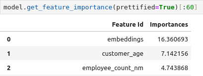

# Datafusion_2024 Публичное решение.(Победитель в номинации: Companion - лучшее публичное решение)
 Задача: Модели оттока

### Автор: Александров Иван

Представлены 2 ноутбука:
* Для генерации эмбеддингов по данным транзакций клиентов с помощью библиотеки PyTorchLifestream от SberAiLab
* Пример обучения CatBoost с эмбеддингами в качестве фичей

Готовые эмбеддинги для пользователей из трэйна и теста выложены в публичный датасет на [Kaggle](https://www.kaggle.com/datasets/ivanblch/ptls-dtf/data).
* Файл ptls2.csv - только на данных транзакций
* Файл ptls4.csv - данные транзакций и данные о пользователях

Lifestream не удалось установить на платформе Kaggle.

Скор демонстрационного решения 0.68.  
После добавления новых признаков, подбора гиперпараметров и смешивании с другими моделями достигается скор 0.78+

### Скриншот Feature importance при смешивании с другим публичным решением

